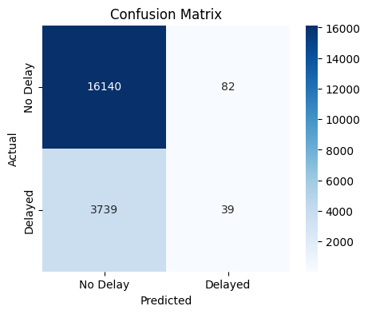
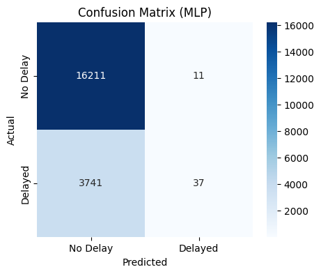

# Flight Delay Prediction

## Overview
This project applies **machine learning** to predict whether a flight will be delayed by more than **15 minutes** based on various flight-related features. The model is trained using **logistic regression and an MLP (Multi-Layer Perceptron) neural network**, with optimized feature engineering and hyperparameter tuning.

## 📂 Dataset
The dataset includes the following features:
- **Time-based:** `Month`, `DayofMonth`, `DayOfWeek`, `DepTime`
- **Flight-related:** `UniqueCarrier`, `Origin`, `Dest`, `Distance`
- **Target Variable:** `dep_delayed_15min` (1 = Delayed, 0 = Not Delayed)

## Models Used
- **Logistic Regression** (Baseline model)
- **MLPClassifier (Neural Network)**
- **Performance Metrics:** Accuracy, Confusion Matrix, ROC Curve




## Installation
### **1. Clone the Repository**
```bash
git clone https://github.com/joseantoniormc/flight_delay_prediction.git
cd flight_delay_prediction
```

## Usage
### **Run the Notebook**
Open and run the Jupyter Notebook:
```bash
jupyter notebook flight_delay.ipynb
```

### **Train the Model**
The notebook preprocesses the data, trains the model, and evaluates its performance using:
```python
mlp = MLPClassifier(hidden_layer_sizes=(100, 50), max_iter=500, random_state=42)
mlp.fit(X_train, y_train)
```

### **Make Predictions**
```python
mlp_pred = mlp.predict(X_test)
```

## Results & Insights
- The **MLP model outperformed Logistic Regression**, achieving higher accuracy and better classification performance.
- **Feature Engineering:** Encoding categorical variables and transforming time features improved the model’s predictions.
- **Hyperparameter Tuning:** Adjusting hidden layers, activation functions, and regularization boosted model performance.

## License
This project is licensed under the MIT License.

